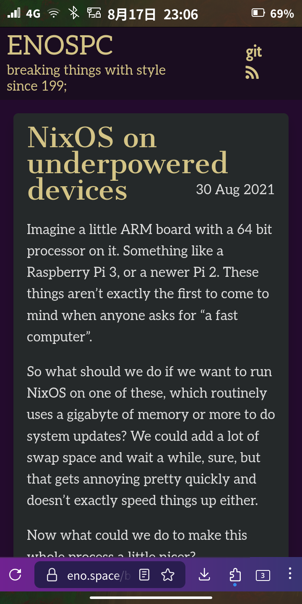

# mobile-config

My [NixOS](https://nixos.org/) configuration for running [Mobile NixOS](https://mobile-nixos.github.io/mobile-nixos/) on a [PinePhone](https://wiki.pine64.org/wiki/PinePhone).


<sub>[microfetch](https://github.com/NotAShelf/microfetch) by NotAShelf, [Beautiful freedom](https://forums.puri.sm/t/tutorial-add-a-custom-background-in-phosh/13385/23) by Ick - [CC-BY-SA 4.0](https://creativecommons.org/licenses/by-sa/4.0/deed.en)</sub>


<sub>Source: [NixOS on underpowered devices](https://eno.space/blog//2021/08/nixos-on-underpowered-devices) by pennae</sub>


<sub>Source: [UtopiaOS for PainPhone](https://www.reddit.com/r/pinephone/comments/171wlt7/utopiaos_for_painphone/) by coldpizza</sub>

## Features

- Working phone calls
- Working SMS
- Working camera
- 4G support
- Video support
- `mobile-config-firefox`

## Usage

Build and start a virtual machine of the phone on x86_64-linux:

```fish
nixos-rebuild build-vm --flake .#mobile-nixos-vm && ./result/bin/run-mobile-nixos-vm
```

Build and deploy on reboot to the aarch64 phone:

```fish
nixos-rebuild boot --flake .#mobile-nixos --target-host YOUR_PINEPHONE_ADDRESS --use-remote-sudo
```
